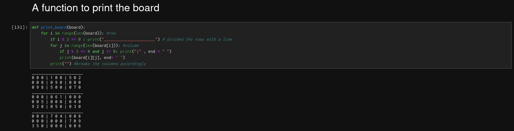
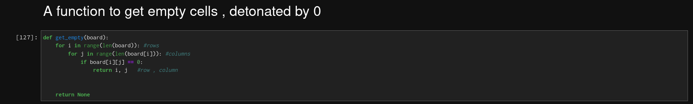
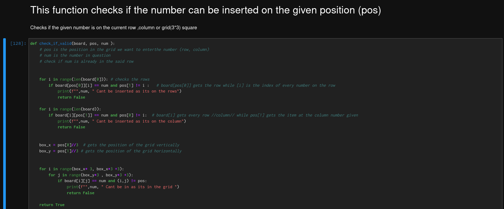

# Soduku_Solver
Solving soduku puzzles using backtracking Algorithms

  # Helper functions Used
***
## 1. Printer function to partition the board gridwise

***
## 2. Function to search for an  empty cell

***
## 3. Function to check if a number is valid to fit in the empty cell provided by the fucntion above

